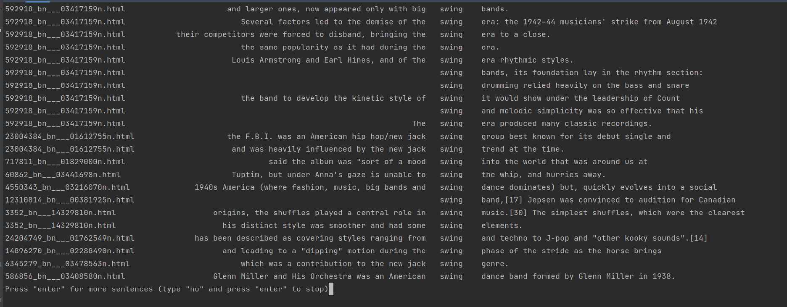
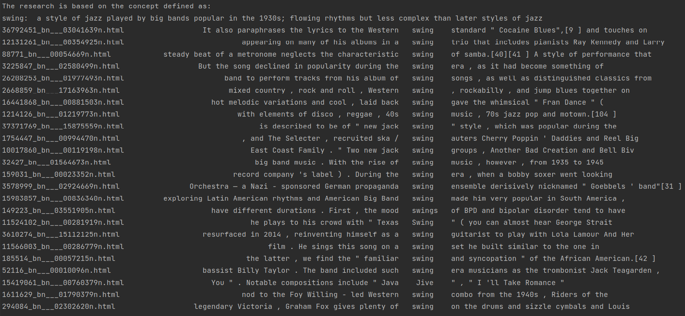

# Interrogation Functionalities of Polifonia Textual Corpus

> :warning: **Only the English part of the corpus can be interrogated at this stage**

The interrogation of the corpus takes advantage of the annotation described in the *[annotations](https://github.com/polifonia-project/Polifonia-Corpus/tree/master/annotations)* section of this repository.

The main script to use to interrogate the corpus is:


> interrogate.py

It has different parameters that can be used to select, navigate and store sentences of the corpus that satisfy aspecific query.
The parameters are explained below their use is described in the following sections.

1. --annotations_path: indicates the path were the annotations databases are stored (the default value is annotation/db/)
2. --corpus: indicates what module of the corpus has to be queried. It can be Wikipedia, Books, Periodicals or Pilots
3. --lang: indicates the language to use for the interrogations. It can be DE, EN, ES, FR, IT or NL
4. --interrogation_type: indicates the type of interrogation that has to be conducted. It can be Keyword, concept or entity. Each interrogation type will be explained in the next sections.
5. --query: the keyword to use for the interrogation, e.g., guitar.
6. --sent_n: indicates the number of sentences to get at each interrogation.
7. --save_to_file: indicates if the results of the interrogations have to be saved to a file. The default value of this parameter is 'No'.

# How to use this repository

The first step is to clone the repository
```
> git clone https://github.com/polifonia-project/Polifonia-Corpus.git
> cd Polifonia-Corpus
```

The second step involves the download of the required packages
```
> pip install -r requirements.txt
> cd interrogation
```

Once the environment is set up, it is possible to test the script using the default parameters with:

```
> python interrogate.py
```

The annotations related to a query will be automatically downloaded the first time that the script is used.

To change the default keyword, the --query parameter has to be passed to the script:
```
> python interrogate.py --query swing
```
In this way the word 'swing' will be searched trought the corpus and some sentences will be displayed.


## Keyword search
The keyword search can be used to select the sentences in the corpus that contain that specific keyword.

### API

Setting the parameter "--interrogation_type" to "keyword" tells the system to interrogate the corpus searching the keywords
provided through the "--query" parameter. 

```
> python interrogate.py --interrogation_type keyword  --query swing
```

### Example
The following prompt will retrieve from the Wikipedia corpus (--corpus Wikipedia) sentences in English (--lang EN) that contain the keyword "swing".
It will show to the user up to 100 sentences (--sent_n 100) at time and ask the user if he wants to repeat the query to retrieve other sentences.
All the sentences that have been shown will be saved to a file (--save_to_file Yes) in the "out" folder of the repository.

```
> python interrogate.py --annotations_path ../annotations/db --corpus Wikipedia --lang EN --interrogation_type keyword  --query swing --sent_n 100 --save_to_file Yes
```



The results of the query are presented sentence by sentence. In each line of the results there is the document id of the sentence and the keyword in context.
If the results are saved the entire sentences are saved and not just the snippets of the keyword context.

## Concept search

The concept search is similar to the keyword search but instead of searching the corpus using keywords it uses concepts (the specific sense of a word), exploiting the sense annotation of the corpus.

### API

Setting the parameter "--interrogation_type" to "concept" tells the system to interrogate the corpus searching the sentences annotated with the specified WordNet sense.
To select a concept, a lemma is provided through the "--query" parameter and the system will ask the user to select a concept related to the provided lemma.

```
> python interrogate.py --interrogation_type concept  --query swing
```

### Example
The following prompt will retrieve from the Wikipedia corpus (--corpus Wikipedia) sentences in English (--lang EN) that contain a concept that has "swing" as its lemma.
To select the concept the system will provide a list of concepts as shown below.


Entering "4", the system will show to the user up to 100 sentences (--sent_n 100) annotated with the corresponding sense at time and ask the user if he wants to repeat the search to retrieve other sentences.
All the sentences that have been shown will be saved to a file (--save_to_file Yes) in the "out" folder of the repository.

```
> python interrogate.py --annotations_path ../annotations/db --corpus Wikipedia --lang EN --interrogation_type concept  --query swing --sent_n 100 --save_to_file Yes
```



The results of the query are presented sentence by sentence. In each line of the results there is the document id of the sentence and the keyword in context.
If the results are saved the entire sentences are saved and not just the snippets of the keyword context.


## Entity search
The concept search is similar to the concept search but instead of searching the corpus using word senses it uses named entities (as specified in a knowledge base, Wikipedia in our case), exploiting the sense annotation of the corpus.


### API
Setting the parameter "--interrogation_type" to "entity" tells the system to interrogate the corpus searching the sentences annotated with the specified Wikipedia entity.
To select an entity, a word is provided through the "--query" parameter and the system will ask the user to select an entity related to the provided word.

```
> python interrogate.py --interrogation_type entity  --query wagner
```

### Example
The following prompt will retrieve from the Wikipedia corpus (--corpus Wikipedia) sentences in English (--lang EN) that contain a mention to a named entity "bach" as its lemma.
To select the specific named entity the system will provide a list of named entities as shown below.


Entering "0", the system will show to the user up to 100 sentences (--sent_n 100) annotated with the corresponding named entity at time and ask the user if he wants to repeat the search to retrieve other sentences.
All the sentences that have been shown will be saved to a file (--save_to_file Yes) in the "out" folder of the repository.

```
> python interrogate.py --annotations_path ../annotations/db --corpus Wikipedia --lang EN --interrogation_type entity --query bach --sent_n 100 --save_to_file Yes
```

